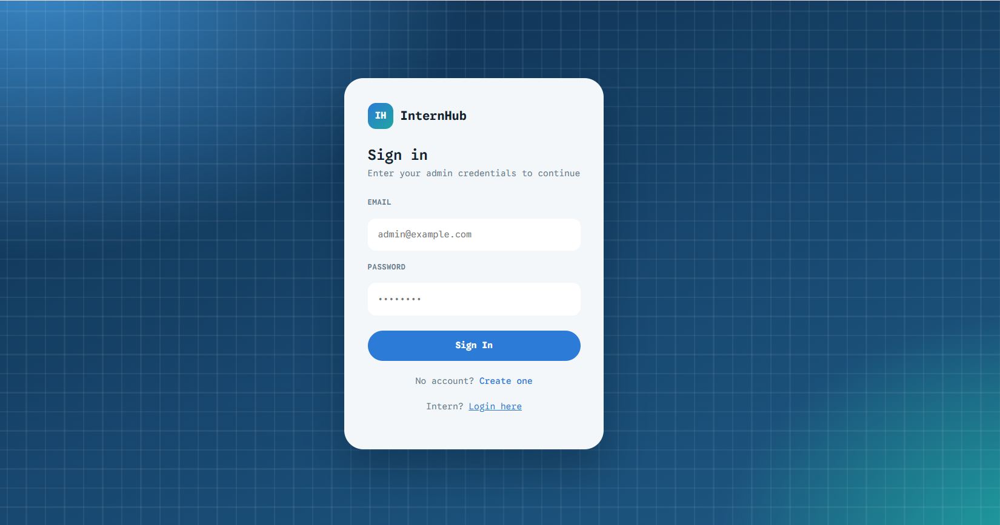
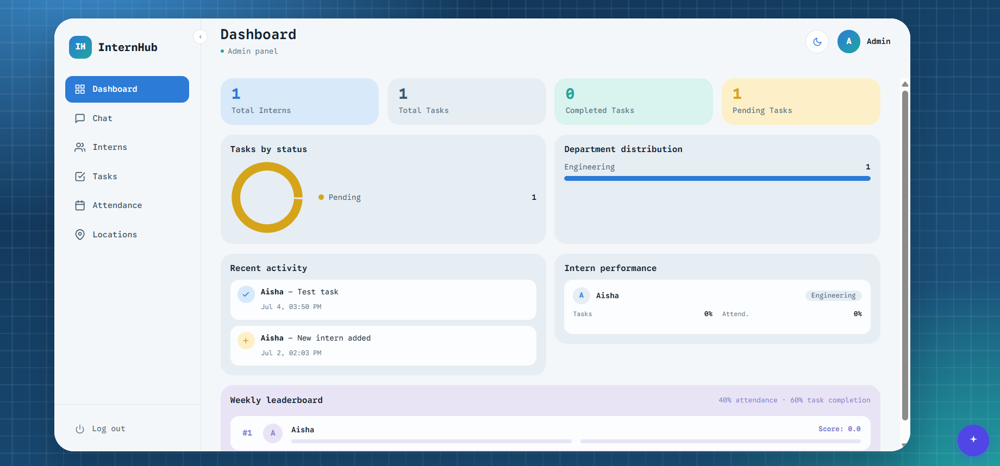
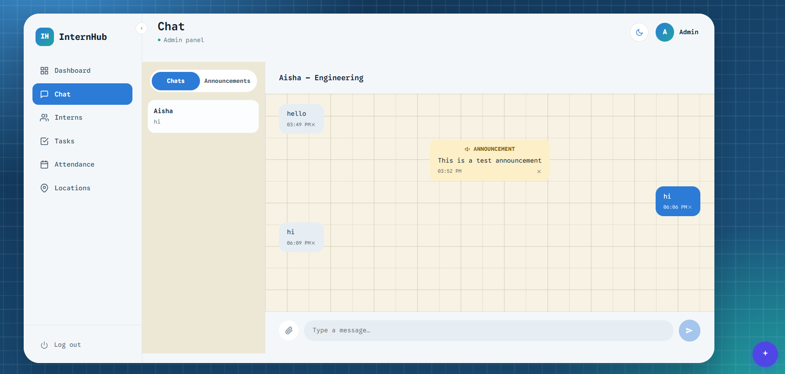
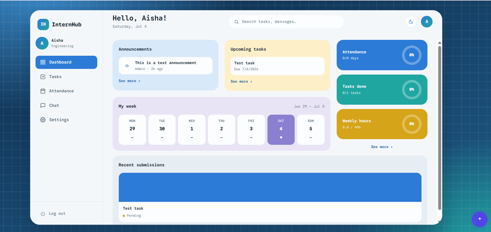

# InternHub (Interns-Portal)

> A multi-tenant internship management platform: geofenced + face-verified attendance, task assignment and review, an AI assistant for admin workflows, real-time chat, and Slack/email notifications — with tenant isolation, optimistic concurrency, and audit logging built in from the schema up.

---

## Why is it needed

Managing interns across departments usually ends up as a spreadsheet, a WhatsApp group, and someone manually cross-checking who actually showed up. Attendance is self-reported, task status lives in someone's head, and there's no single place an admin can see who's overdue, who's idle, and who's actually on-site.

InternHub replaces that with one system: interns check in from a phone, the location is verified against a geofence and their face is matched against a stored descriptor before the check-in is accepted, tasks are assigned and reviewed with full history, and admins get a dashboard, Slack digests, and email alerts instead of asking around. Every organization that signs up gets its own fully isolated workspace — the same deployment serves many companies without any of them seeing each other's data.

---

## Who It's For

- **Companies running internship or trainee programs** who need real attendance verification (not an honor system) tied to physical locations.
- **Program coordinators** who want task assignment, submission review, and deadline tracking in one place instead of email threads.
- **Anyone tired of asking "wait, who approved this?"** — every create/update/delete on the core entities is logged with who did it and what changed.

---

## Architecture

```
┌───────────────────────────────────────────────────────────────┐
│                      Clients                                  │
│   Admin dashboard (desktop)   ·   Intern portal (mobile web)  │
└───────────────────────────┬───────────────────────────────────┘
                            │  HTTPS, cookies (access/refresh/csrf)
                            ▼
┌───────────────────────────────────────────────────────────────┐
│                  Express API (Node.js)                        │
│                                                                │
│  helmet · hpp · CORS(credentials) · rate limiting             │
│  cookie-parser · CSRF double-submit check on mutating routes  │
│  authMiddleware — verifies access_token JWT, checks           │
│    token_blacklist (jti), attaches { id, role, organization_id }│
└───────┬─────────────────┬──────────────────┬───────────────────┘
        │                 │                  │
        ▼                 ▼                  ▼
 ┌─────────────┐  ┌────────────────┐  ┌────────────────────┐
 │  Auth flow   │  │  Org-scoped     │  │  Check-in flow      │
 │              │  │  CRUD models    │  │                     │
 │ signup →     │  │ (interns/tasks/ │  │ geo.js — haversine   │
 │ new org+admin│  │ submissions/    │  │  distance vs. the    │
 │ login/refresh│  │ locations/chat) │  │  intern's assigned   │
 │ (rotation +  │  │  every query    │  │  location radius     │
 │ reuse detect)│  │  requires       │  │ faceMatch.js — face  │
 │ logout       │  │  organization_id│  │  descriptor compare  │
 │ (blacklist)  │  │  version+       │  │  against stored      │
 │              │  │  optimistic lock│  │  enrollment          │
 └──────────────┘  │  soft delete    │  └────────────────────┘
                    └────────┬────────┘
                             │
                             ▼
                  ┌─────────────────────┐
                  │   PostgreSQL         │
                  │                     │
                  │ interns_owner  → DDL │  (migrations only)
                  │ interns_app    → DML │  (running server)
                  │                     │
                  │ organizations, admins, interns, tasks,     │
                  │ submissions, attendance, locations, chat,  │
                  │ audit_logs, sessions, token_blacklist       │
                  └─────────────────────┘

┌───────────────────────────────────────────────────────────────┐
│                 Scheduled jobs (node-cron), per organization   │
│  Mon 8am  — weekly attendance report (email)                  │
│  Mon 8am  — weekly Slack digest                                │
│  Daily 9am — task deadline alerts (Slack)                       │
└───────────────────────────────────────────────────────────────┘

┌───────────────────────────────────────────────────────────────┐
│              AI assistant (Groq, admin dashboard only)         │
│  Natural-language task assignment, filtering, editing —        │
│  operates through the same org-scoped API, no special access   │
└───────────────────────────────────────────────────────────────┘
```

---

## Screenshots






---

## Key Design Decisions

**`organization_id` as a mandatory first parameter, not an afterthought.** Every model function — `InternModel.getById(organizationId, id)`, `TaskModel.update(organizationId, id, ...)` — takes the organization ID as an explicit, non-optional argument. There's no code path where a query can accidentally run without a tenant filter, because there's nothing to fall back to: leave it out and the function call itself doesn't compile against its own usage patterns.

**Admin/intern email is globally unique, not per-organization.** Deliberately so — there's no "pick your workspace" step at login. A person logs in with just their email and password, and their `organization_id` is resolved server-side from their account, not chosen by them.

**Optimistic locking via a `version` column + trigger, not row locks.** `interns`, `tasks`, `submissions`, and `locations` each have a `version` column bumped automatically by a `BEFORE UPDATE` trigger. Every update statement requires `AND version = $N` in its `WHERE` clause alongside `AND organization_id = $M` — a mismatch means someone else edited the row first, and the API returns 409, not a silent overwrite.

**Soft delete, not `DELETE FROM`.** Deleted interns/tasks/locations keep a `deleted_at` timestamp instead of disappearing, so past attendance and task history survive. The email uniqueness constraint is a partial index (`WHERE deleted_at IS NULL`), so a soft-deleted intern's email frees up for reuse without permanently blocking it.

**404, not 403, on cross-tenant access.** If an intern or admin requests a resource that exists but belongs to a different intern or organization, the API returns 404 ("not found"), never 403 ("forbidden"). A 403 confirms the resource exists — 404 gives an attacker no signal either way.

**Refresh tokens are single-use with reuse detection.** Every refresh rotates the token: the old one is marked revoked and a new one issued. If a revoked-but-previously-valid refresh token is ever replayed (a sign of theft), every session for that account is revoked immediately, not just the one request.

**The database itself can't be dropped by the running app.** The live server connects as `interns_app`, a role with `SELECT/INSERT/UPDATE/DELETE` only — no `CREATE`/`ALTER`/`DROP`/`GRANT`. Migrations run separately under `interns_owner`. A SQL injection bug or a stray raw query can corrupt data at worst; it structurally cannot drop a table.

---

## Security

**Cookie-based auth, not localStorage tokens.** `access_token` (short-lived JWT, HttpOnly), `refresh_token` (opaque, HttpOnly, path-scoped to `/api/auth`, stored hashed — never in plaintext — in the `sessions` table), and `csrf_token` (JS-readable, echoed back as `X-CSRF-Token` on every mutating request). Storing tokens in HttpOnly cookies instead of localStorage means they're never reachable by an XSS payload.

**CSRF protection via double-submit cookie.** The CSRF token is set in a readable cookie and must be echoed in a request header; an attacker forging a cross-site request can make the browser send the cookie automatically, but can't read it to also set the matching header.

**Immediate logout, not just cookie clearing.** Logging out blacklists the current access token's `jti` server-side (checked on every request) so it's dead immediately, not just until the client stops sending it.

**Rate limiting, security headers, and body caps.** `express-rate-limit` (tighter on auth endpoints), `helmet` for standard security headers, `hpp` against HTTP parameter pollution, and request body size caps.

**Audit logging with a dedicated `organization_id` column.** Every create/update/delete on interns, tasks, submissions, and locations is logged with actor, action, and a field-level diff of what changed — and the log row carries its own `organization_id` rather than requiring a join through the actor, so a per-org audit query can never accidentally leak across tenants through a forgotten join.

**Face verification is a second factor on check-in, not the only one.** Attendance requires both a geofence match (haversine distance against the intern's assigned location radius) and a face descriptor match — a stolen phone alone isn't enough to fake a check-in without also being physically at the location.

**DB role separation.** See `backend/docs/role_separation.md` and `backend/src/config/roles.sql` for the full runbook — the running server and the migration process use structurally different, minimally-privileged Postgres roles.

---

## Threat Model

**What this protects against**

- *Session/token theft via XSS* — HttpOnly cookies mean a successful script injection still can't read the access or refresh token directly.
- *CSRF* — double-submit cookie pattern rejects mutating requests that don't echo the CSRF token in a header, which cross-site forms can't do.
- *Stolen refresh token replay* — single-use rotation with reuse detection revokes every session for the account the moment a dead token is replayed.
- *Cross-tenant data access* — every query is organization-scoped by construction, and cross-tenant lookups return 404, giving no signal that the resource exists elsewhere.
- *Lost-update races* — optimistic locking rejects concurrent edits to the same row with a 409 rather than silently discarding one admin's changes.
- *Catastrophic DB-layer bugs* — even a raw, unparameterized query bug in the running server can only manipulate rows the `interns_app` role has DML rights to; it cannot drop or alter schema.
- *Fake attendance* — geofence + face-match together mean neither GPS spoofing alone nor a stolen device alone is sufficient.

**What it explicitly does not protect against**

- *A compromised admin account within its own organization* — role separation is between tenants and between DB privilege levels, not between an admin and the data they're authorized to manage.
- *Face descriptor spoofing with a high-quality photo/video* — `face-api.js` matching is not liveness-verified; a sufficiently good deepfake or photo is a known limitation of descriptor-matching alone.
- *Compromise of the JWT_SECRET or database credentials themselves* — these are held as environment secrets; there's no HSM/KMS integration in this build.

**What a production hardening pass would add next**

- Liveness detection alongside face descriptor matching.
- Automatic secret rotation for `JWT_SECRET` with an overlap window.
- Structured request logging / APM for anomaly detection, beyond the current audit log.

---

## Stack

| Component | Technology |
|---|---|
| Backend | Node.js, Express |
| Database | PostgreSQL (raw `pg`, no ORM) |
| Auth | JWT (access token) + opaque refresh tokens, bcrypt password hashing |
| Frontend | React 18, React Router |
| Styling | Bootstrap 5 |
| Maps / geofencing | Leaflet, custom haversine distance check |
| Face verification | face-api.js |
| AI assistant | Groq SDK |
| Notifications | Nodemailer (email), Slack Web API |
| Scheduled jobs | node-cron |
| Security middleware | helmet, hpp, express-rate-limit, cookie-parser |

---

## Prerequisites

- Node.js 18+
- PostgreSQL 14+

---

## Setup

```bash
git clone <repo-url>
cd Interns-Portal
```

**Backend:**

```bash
cd backend
npm install
cp .env.example .env
```

Fill in `.env` — at minimum `DB_HOST`, `DB_NAME`, `JWT_SECRET`, `ADMIN_SIGNUP_KEY` (required to create the first admin account), and `FRONTEND_URL` (must exactly match where the frontend runs, for CORS + cookie behavior).

**Database role separation (recommended before going anywhere near production data):**

Follow `backend/docs/role_separation.md` to create the `interns_owner` (migrations) and `interns_app` (runtime) Postgres roles via `backend/src/config/roles.sql`, then set `DB_USER`/`DB_PASSWORD` to the `interns_app` credentials and `DB_MIGRATE_USER`/`DB_MIGRATE_PASSWORD` to the `interns_owner` credentials.

**Run the migration:**

```bash
node src/config/migrate.js
```

**Frontend:**

```bash
cd ../frontend
npm install
cp .env.example .env
```

---

## Running

Two processes, each in its own terminal:

```bash
# 1 — Backend
cd backend
npm start          # or: npm run dev (nodemon)

# 2 — Frontend
cd frontend
npm start
```

Admin dashboard: **http://localhost:3000** — sign up the first admin at `/signup` using your `ADMIN_SIGNUP_KEY`. By default, signup creates a brand new, fully isolated organization. An existing admin can instead generate an invite code from **Settings** so a co-worker joins their *same* organization as a second admin — see [Multi-Tenancy & Organizations](wikis/Multi-Tenancy-and-Organizations.md) for details.

Intern portal: **http://localhost:3000/intern/login** — interns are created by an admin from the dashboard, not self-registered.

---

## Multi-Tenancy in Practice

Signing up with the global `ADMIN_SIGNUP_KEY` and no invite code always creates a brand-new, fully isolated organization — no shared data, no workspace picker at login (a person's `organization_id` is resolved server-side from their account). Signing up *with* an invite code generated by an existing admin joins that admin's existing organization instead, as a second admin. Full walkthrough, including how to verify isolation yourself, in [wikis/Multi-Tenancy-and-Organizations.md](wikis/Multi-Tenancy-and-Organizations.md).

See the [wikis](wikis/Home.md) for a full breakdown of the organization model, every admin/intern feature, the security model, and setup.

---

## Project Structure

```
Interns-Portal/
├── wikis/                    # deep-dive docs — architecture, multi-tenancy, admin/intern guides, security, setup
├── backend/
│   ├── docs/
│   │   └── role_separation.md
│   └── src/
│       ├── config/         # db.js, migrate.js, roles.sql, reassign_ownership.sql
│       ├── controllers/     # request handlers per resource
│       ├── middleware/      # auth, CSRF, error handling, uploads
│       ├── models/          # org-scoped DB access, one file per entity
│       ├── routes/          # Express route definitions
│       ├── services/        # audit logging, email, Slack, sessions
│       ├── utils/           # geo (haversine), face matching, pagination, tokens
│       └── validators/      # express-validator rules per resource
└── frontend/
    └── src/
        ├── components/
        │   ├── common/      # shared UI, AI chatbot, pagination
        │   ├── forms/       # intern/task/location forms
        │   ├── intern/      # intern-portal-specific components
        │   └── layout/      # admin dashboard shell
        ├── context/         # auth state
        ├── pages/           # admin pages (Dashboard, Interns, Tasks, Chat, Locations, Attendance)
        │   └── intern/      # intern-facing pages (check-in, tasks, chat, verify identity)
        └── services/        # Axios API clients per resource
```
